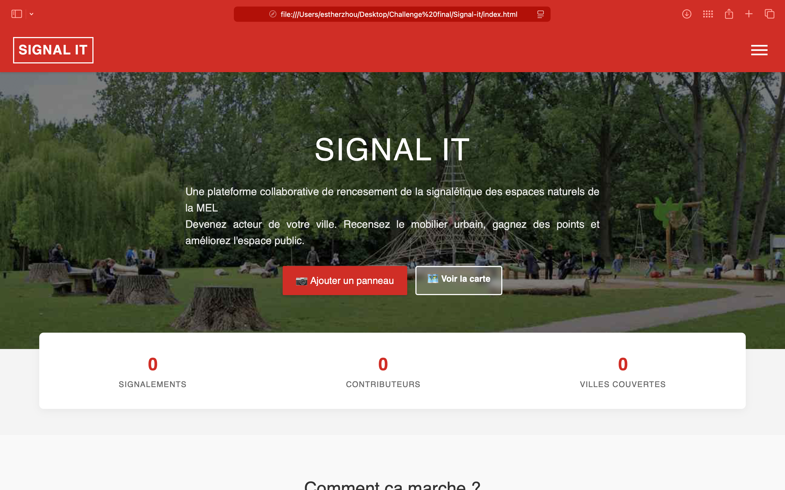

# Signal-it

**Plateforme collaborative de recensement de la signalétique des espaces verts.**

Signal It est une application web mobile-first permettant aux citoyens de devenir acteurs de leur ville (Métropole Européenne de Lille). En signalant des panneaux  (neufs, abîmés ou manquants), les utilisateurs gagnent des points, complètent leur "Sigdex" et débloquent des récompenses culturelles.



## Fonctionnalités Clés

### Cartographie & Données
- **Carte Interactive :** Visualisation de tous les signalements sur une carte OpenStreetMap (via Leaflet).
- **Tableau de bord de données :** Vue liste avec filtres dynamiques (par état, par type) et export CSV.
- **Détails :** Navigation fluide entre la liste et la carte ("Fly-to").

### Signalement Intelligent
- **Importation de photo**
- **Géolocalisation Auto :** Extraction automatique des coordonnées GPS depuis les métadonnées (EXIF) de la photo.
- **Mode hors-ligne (simulé) :** Sauvegarde en brouillon (`localStorage`) si l'utilisateur n'est pas connecté.

### Gamification (Le Sigdex)
- **Collection :** Visualisation des trouvailles sous forme de cartes (type Pokédex).
- **Progression :** Barre de niveau et déblocage de médailles (Bronze, Argent, Or).
- **Récompenses :** Système de "boutique" pour échanger ses points contre des avantages réels (Tickets métro, Musée, Piscine...).

### Espace Membre
- **Authentification :** Système complet (Inscription, Connexion, Mot de passe oublié) simulé.
- **Profil :** Gestion des informations et modification sécurisée du mot de passe.
- **Persistance :** Toutes les données utilisateur sont stockées localement dans le navigateur.

## Stack Technique

Ce projet est conçu en **Vanilla JS** (JavaScript pur) sans framework lourd, pour une performance maximale et une compréhension approfondie du DOM.

- **Frontend :** HTML5, CSS3 (Variables CSS, Flexbox, Grid).
- **Logique :** JavaScript (ES6+).
- **Cartographie :** [Leaflet.js](https://leafletjs.com/).
- **Traitement Image :** [Exif-js](https://github.com/exif-js/exif-js) pour lire les métadonnées GPS.
- **Base de données (Mock) :** `localStorage` du navigateur (Simulation d'un Backend).

## Structure du Projet

```text
SIGNAL-IT/
│
├── index.html                # Page d'accueil (Landing Page)
├── createAccount.html        # Page de création de compte
├── account.html              # Page de connexion
├── add-sign.html             # Formulaire d'ajout de signalement
├── password.html             # Page mot de passe oublié
├── dashboard.html            # Tableau de bord utilisateur
├── about.html                # Page Qui sommes-nous ?
├── map.html                  # Carte et Données
│
└── assets/
    ├── css/
    │   └── style.css          # Feuille de style globale
    ├── js/
    │   ├── script.js          # Scripts globaux (Menu, Toast)
    │   ├── map.js             # Logique Leaflet
    │   ├── dashboard.js       # Logique Gamification
    │   ├── add-sign.js        # Logique Caméra/GPS
    │   ├── createAccount.js   # Logique Création de compte
    │   └── account.js         # Logique Auth
    └── images/                # Ressources graphiques
